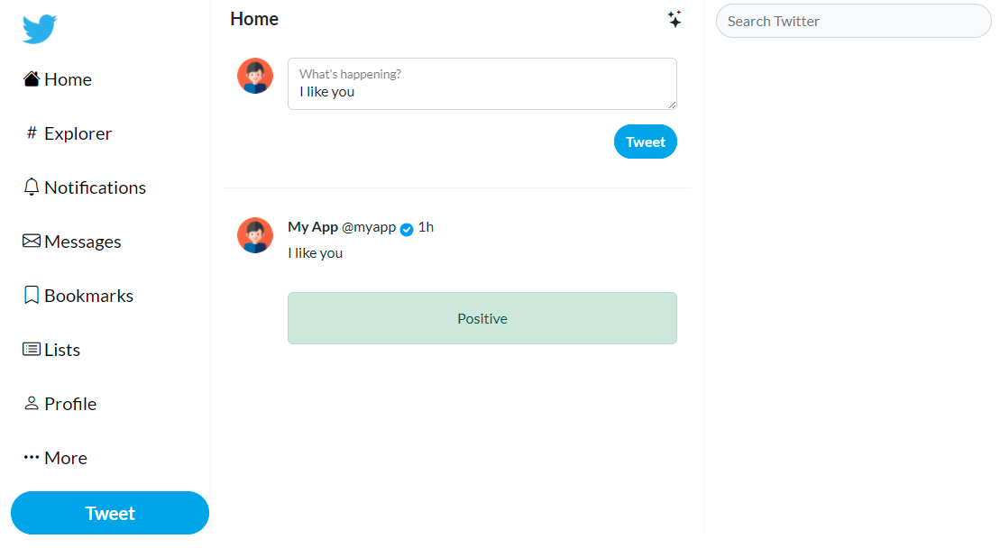

# :bird: Tweet sentiment analysis

Tweet sentiment analysis web with machine learning.



Libraries:

- Flask
- Scikit-learn
- Nltk
- Bootstrap 5.2
- Flask-WTF
- Docker

## :floppy_disk: Install

Create a virtual enviroment:

```shell
python -m venv env
```

Activate your enviroment:

- Windows:

```shell
env/Scripts/activate
```

- Mac:

```shell
env/bin/activate
```

Upgrade pip version:

```shell
python.exe -m pip install --upgrade pip
```

Install requirements:

```shell
pip install -r requirements.txt
```

Create a **.env** file o set your enviroment var with:

```shell
SECRET_KEY='secret'
```

**Check .env.example*

## :running_man: Run

### :triangular_flag_on_post: Before running flask

1. Download data file from:

```http
https://www.kaggle.com/datasets/kazanova/sentiment140
```

2. Unzip file into: **ml-dev/data**
   
3. Run: **ml-dev/text-classification.ipynb**
   
4. Copy: **ml-dev/pipeline.pickle** to **app/models**
   
5. Run flask

<br>

### :snake: Run flask

```shell
flask run
```

Or 

### :whale: Docker compose:

```shell
docker compose -f "docker-compose.yml" up -d --build
```

### :computer: Access

Go to:

```http
http://127.0.0.1:5000
```

## :whale2: Docker hub

Image in docker hub:

```shell
docker push ezeparziale/tweet-clasification:latest
```

## :books: Bibliography

Data from:

```http
https://www.kaggle.com/datasets/kazanova/sentiment140
```

ML notebook from:

```http
https://github.com/python-engineer/ml-deployment/tree/main/docker-flask/ml-dev
```
